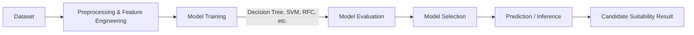

---


# Candisys: Candidate Evaluation System

> **A Machine Learning exploration project for academic purposes.**  
> Candisys evaluates the suitability of job applicants against employer requirements using a variety of ML models.  
> The project serves as a learning platform for dataset preprocessing, model training, evaluation, and real-world style inference.

---

## 📌 Abstract
The candidate evaluation process is often subjective and time-consuming.  
This project explores the use of **Machine Learning (ML)** to assess whether an applicant is **suitable or not suitable** for a role given employer requirements.  
The system is designed as an academic learning tool rather than a production-ready solution.

---

## 📂 Project Structure
```

Candisys/
│
├── datasets/          # Original and processed datasets
├── models/            # Trained ML models (.pkl)
│
├── config.py          # Logging, configuration, model paths
├── preprocessor.py    # Dataset preprocessing & feature engineering
├── model_trainer.py   # Core model training logic (verbose & documented)
├── train.py           # Script to train models (SVM, Decision Tree, RFC, etc.)
├── predictor.py       # Official inference / prediction script
├── optimizer.py       # Balancing strategies (oversampling, undersampling, SMOTE)
├── inspector.py       # Inspect original vs. processed datasets
├── tests.py           # Unit tests and evaluation checks
├── requirements.txt   # Python dependencies
└── README.md          # Project documentation

````

---

## ⚙️ Installation
1. Clone the repository:
   ```bash
   git clone https://github.com/skye-cyber/Candisys.git
   cd Candisys
```

2. Create a virtual environment and install dependencies:

   ```bash
   python -m venv venv
   source venv/bin/activate   # Linux/macOS
   venv\Scripts\activate      # Windows

   pip install -r requirements.txt
   ```

3. Ensure Python **3.9+** is used.

---

## 📊 Dataset

* The dataset is based on **synthetic and real-world inspired candidate-employer matching data**.
* Each record compares **applicant features** (age, education, experience, technical score, interview score, previous employment) with **employer requirements**.
* Labels:

  * `Suitable` ✅
  * `Not Suitable` ❌

⚠️ For academic exploration only. Not representative of real hiring practices.

---

## 🔄 Workflow


## 🤖 Models Implemented

The following ML models are implemented and benchmarked:

* Logistic Regression
* Support Vector Machine (SVM)
* Random Forest Classifier
* LightGBM
* Decision Tree (best performing so far ✅)

### Decision Tree Results
```
python train.py -m decision_tree
- INFO - Dataset: /home/skye/Candisys/datasets/open_dataset.csv
--------------------------------------------------
- INFO - Training Decision Tree...
--------------------------------------------------
Decision Tree's Accuracy is: 100.00%
--------------------------------------------------
Classification Report for Decision Tree:
--------------------------------------------------
              precision    recall  f1-score   support

       False       1.00      1.00      1.00    170738
        True       1.00      1.00      1.00    170786

    accuracy                           1.00    341524
   macro avg       1.00      1.00      1.00    341524
weighted avg       1.00      1.00      1.00    341524

--------------------------------------------------
Cross-validation scores for Decision Tree: [1. 1. 1. 1. 1.]
--------------------------------------------------
- INFO - Decision Tree model saved to /home/skye/Candisys/models/DecisionTree.pkl
--------------------------------------------------
```

### Random Forest Results
```
 python train.py -m RFC          
- INFO - Dataset: /home/skye/Candisys/datasets/open_dataset.csv
--------------------------------------------------
- INFO - Training Random Forest Classifier...
--------------------------------------------------
Random Forest Classifier's Accuracy is: 100.00%
--------------------------------------------------
Classification Report for Random Forest Classifier:
--------------------------------------------------
              precision    recall  f1-score   support

       False       1.00      1.00      1.00    170738
        True       1.00      1.00      1.00    170786

    accuracy                           1.00    341524
   macro avg       1.00      1.00      1.00    341524
weighted avg       1.00      1.00      1.00    341524

--------------------------------------------------
Cross-validation scores for Random Forest Classifier: [1. 1. 1. 1. 1.]
--------------------------------------------------
- INFO - Random Forest Classifier model saved to /home/skye/Candisys/models/RFClassifier.pkl
--------------------------------------------------
```

The **Decision Tree** emerged as the most effective model, providing interpretable rules and excellent performance on this dataset.

---

## 🚀 Usage

### 1. Training

Train a model (e.g., Decision Tree):

```bash
python train.py -m decision_tree
```

Other options: `xgboost` `SVM`, `LR`, `RFC`, `lightgbm`

---

### 2. Testing Models

Run evaluation tests:

```bash
python tests.py
```

---

### 3. Making Predictions

Run candidate evaluation with predefined employer requirements and applicant input:

```bash
python predictor.py
```

Example output:

```
--- Candidate Evaluation ---
Applicant vs Employer Differences (Applicant - Employer):
  age_diff: -3
  education_diff: 0
  experience_diff: 1
  tech_score_diff: 5
  interview_score_diff: 15
  prev_employment_match: 1

Prediction: Suitable ✅
Confidence -> Suitable: 100.00%, Not Suitable: 0.00%
---------------------------
```

---

## 📈 Data Optimization

Implemented methods for balancing dataset:

* Oversampling
* Undersampling
* SMOTE (Synthetic Minority Oversampling Technique)

These ensure fairer model training and avoid bias toward one class.

---

## 🔮 Future Work

* Add CLI support for training/prediction with arguments.
* Explore deep learning approaches (e.g., neural networks).
* Deploy as a simple API or web demo for interactive testing.
* Expand dataset for robustness and realism.

---

## 📜 License

This program is free software: you can redistribute it and/or modify
    it under the terms of the GNU General Public License as published by
    the Free Software Foundation, either version 3 of the License, or
    (at your option) any later version.

    This program is distributed in the hope that it will be useful,
    but WITHOUT ANY WARRANTY; without even the implied warranty of
    MERCHANTABILITY or FITNESS FOR A PARTICULAR PURPOSE.  See the
    GNU General Public License for more details.

    You should have received a copy of the GNU General Public License
    along with this program.  If not, see <https://www.gnu.org/licenses/>.
    
  See the LICENSE file for more details. See the [LICENSE](LICENSE) file for details.

---

## ✍️ Author

**Skye (Wambua)**
Software Engineering Student | ML Enthusiast
